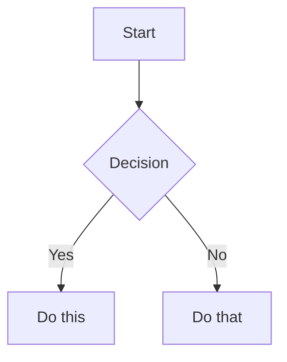

# Obsidian Flavored Markdown Skill

Create and edit valid Obsidian Flavored Markdown (OFM). Obsidian extends CommonMark and GFM with wikilinks, embeds, callouts, properties, comments, and other syntax. This skill covers Obsidian-specific extensions and plugin syntax patterns that appear in notes — standard Markdown (headings, bold, italic, lists, quotes, code blocks, tables) is assumed knowledge.

Use `[[wikilinks]]` for notes within the vault (Obsidian tracks renames automatically) and `[text](url)` for external URLs only.

## Internal Links (Wikilinks)
```markdown
[[Note Name]]                          Link to note
[[Note Name|Display Text]]             Custom display text
[[Note Name#Heading]]                  Link to heading
[[Note Name#^block-id]]                Link to block
[[#Heading in same note]]              Same-note heading link
```

## Block References
Append `^block-id` to any paragraph to make it linkable:

```markdown
This paragraph can be linked to. ^my-block-id
```

For lists and blockquotes, place the ID on a blank line after the block:

```markdown
> A quote block

^quote-id
```

Block IDs are commonly used for citing specific passages. A note with highlights might define IDs like `^ref-123456`, and another note cites them via footnote embeds:

```markdown
[^1]: ![[Source Highlights#^ref-518217]]
```

Preserve existing `^ref-` and `^block-` IDs — they are targets for cross-note references.

## Embeds
Prefix any wikilink with `!` to embed its content inline:

```markdown
![[Note Name]]                         Embed full note
![[Note Name#Heading]]                 Embed section
![[Note Name#^block-id]]               Embed specific block
![[image.png]]                         Embed image
![[image.png|300]]                     Embed image with width
![[document.pdf#page=3]]               Embed PDF page
```

## Properties (Frontmatter)

YAML frontmatter between `---` fences at the top of a file. Obsidian recognizes several value types:

```yaml
---
tags:
  - 📖
aliases:
  - "Clean Title"
create-date: "[[2025-05-21]]"
parent: "[[Source Note]]"
related:
  - "[[Map of Content]]"
  - "[[Sibling Note]]"
modified-dates:
  - "[[2025-05-21]]"
append_modified_update: true
banner: "[[banner-image.webp]]"
cssclasses:
  - cards
  - cards-cols-4
dg-publish: true
---
```

Key patterns:
- **Wiki-linked values** — Dates and note references are wrapped in quotes and wiki-link syntax: `"[[2025-05-21]]"`, `"[[Note Name]]"`. The quotes are required for valid YAML; the `[[brackets]]` let Obsidian resolve them as links.
- **List properties** — Use YAML list syntax for multi-value fields (`tags`, `related`, `modified-dates`, `aliases`). Inline form (`[📖, ♣️]`) and block form (indented `- item`) are both valid.
- **Empty properties** — A property with no value (e.g., `parent:` alone) is valid and common in templates. It signals the field exists but hasn't been filled yet.
- **Boolean properties** — `true`/`false` without quotes: `append_modified_update: true`.

Default Obsidian properties: `tags` (searchable labels), `aliases` (alternative note names for link auto-suggest), `cssclasses` (CSS classes for note styling).

## Tags
```markdown
#tag                    Inline tag
#nested/tag             Nested tag with hierarchy
```

Tags can contain letters, numbers (not as the first character), underscores, hyphens, and forward slashes. Tags defined in frontmatter under `tags:` do not use the `#` prefix.

## Callouts
```markdown
> [!note]
> Basic callout.

> [!warning] Custom Title
> Callout with a custom title.

> [!faq]- Collapsed by default
> Foldable callout (- collapsed, + expanded).
```

Common types: `note`, `tip`, `warning`, `info`, `example`, `quote`, `bug`, `danger`, `success`, `failure`, `question`, `abstract`, `todo`.

Callouts can be nested and can contain any Markdown content including tables, code blocks, and embeds.

## Comments
```markdown
This is visible %%but this is hidden%% text.

%%
This entire block is hidden in reading view.
%%
```

## Highlighting
```markdown
==Highlighted text==
```

## Plugin Code Blocks

Many notes contain fenced code blocks rendered by Obsidian plugins. Treat these as **opaque** — do not modify, reformat, or remove them unless explicitly asked.

### Dataview
Dataview queries produce live tables, lists, and task views from vault metadata:

````markdown
```dataview
TABLE WITHOUT ID
  link(file.link, default(aliases[0], file.name)) as "Name",
  create-date as "Created"
FROM #📖
WHERE contains(related, this.file.link)
SORT create-date DESC
```
````

Dataview also supports inline expressions: `` `= this.file.name` `` renders the current note's filename.

### Dataview Inline Fields
Inline fields embed queryable metadata directly in note content:

```markdown
(FieldName::value)          Parenthesized — hidden label in reading view
[FieldName::value]          Bracketed — visible label in reading view
FieldName:: value           Standalone line field
```

These are commonly used in daily notes for habit tracking (e.g., `(Reading::0)`).

### Templater
Templater blocks contain JavaScript that runs when a template is applied. They appear in template files and occasionally in rendered notes:

```
<%* let name = await tp.system.prompt("Name"); %>
<% tp.date.now() %>
```

Do not modify Templater syntax (`<%* %>`, `<% %>`) — it is executable code, not display content.

## Footnotes
```markdown
Text with a footnote[^1].

[^1]: Footnote content here.

Inline footnote.^[This is inline.]
```

Footnotes can contain embeds, which is useful for citing highlighted passages:
```markdown
[^1]: ![[Source Highlights#^ref-518217]]
```

## Math (LaTeX)
```markdown
Inline: $e^{i\pi} + 1 = 0$

Block:
$$
\frac{a}{b} = c
$$
```

## Diagrams (Mermaid)
````markdown

````

Link Mermaid nodes to Obsidian notes by adding `class NodeName internal-link;`.

## References
- [Obsidian Flavored Markdown](https://help.obsidian.md/obsidian-flavored-markdown)
- [Internal links](https://help.obsidian.md/links)
- [Embed files](https://help.obsidian.md/embeds)
- [Callouts](https://help.obsidian.md/callouts)
- [Properties](https://help.obsidian.md/properties)
