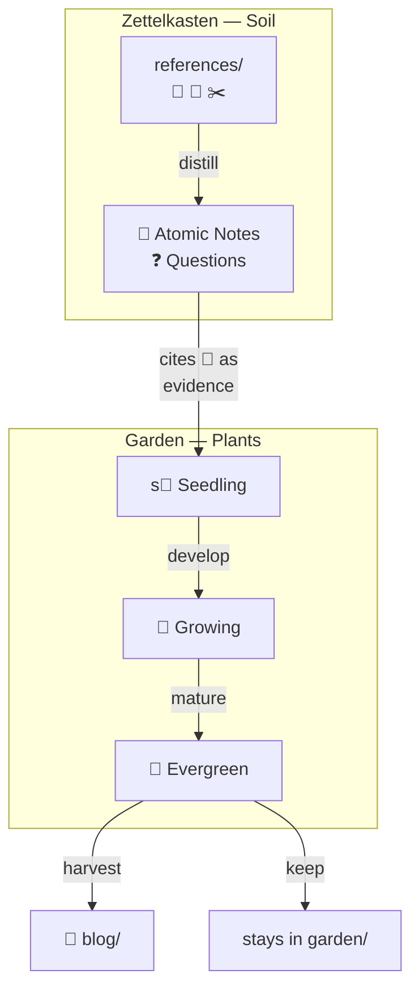
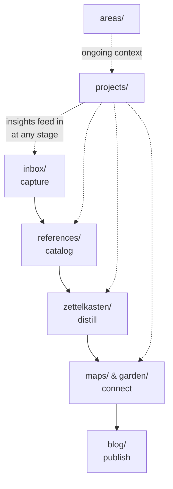

# Knowledge Vault — An Obsidian Knowledge Management System

A personal knowledge management vault built on [Obsidian](https://obsidian.md), combining Zettelkasten, GTD, PARA, and Digital Garden methodologies into a unified system for capturing, organizing, connecting, and publishing knowledge.

This is an example vault. It contains the full structural scaffolding (plugins, templates, workflows) and realistic example content using **exercise science and health research** as the domain. The example notes demonstrate every lifecycle state a note can be in — from raw inbox captures to completed archived projects.

---

## Source Material & Influences

This vault's design draws on several foundational thinkers and systems:

| Source | Work | What it contributes |
|--------|------|-------------------|
| **David Allen** | [*Getting Things Done*](https://gettingthingsdone.com/) (GTD) | Capture → Clarify → Organize → Review → Engage. Weekly Review. Natural Planning Model for projects. |
| **Tiago Forte** | [*Building a Second Brain*](https://www.buildingasecondbrain.com/) (BASB) | PARA (Projects, Areas, Resources, Archive). CODE (Capture, Organize, Distill, Express). Intermediate packets. |
| **Sönke Ahrens** | [*How to Take Smart Notes*](https://takesmartnotes.com/) | Zettelkasten method — rewrite ideas in your own words, link to what you know. Separate your ideas from others'. |
| **Niklas Luhmann** | [Original slip-box method](https://niklas-luhmann-archiv.de/) | Atomicity, linking as thinking, emergence over planning. See the [zettelkasten.de overview](https://zettelkasten.de/overview/). |
| **Fei-Ling Tseng / Sascha Fast** | [Idea Compass](https://zettelkasten.de/posts/creative-technique-within-zettelkasten-framework/) | Four-direction thinking prompt for linking notes: North (origins → `parent:`), West (analogs → `related:`), East (opposites → `challenges:`), South (downstream → backlinks on `parent:`). |
| **Nick Milo** | [*Linking Your Thinking*](https://www.linkingyourthinking.com/) (LYT) | Maps of Content — navigational layers that sit above notes, providing context without hierarchy. |
| **James Clear** | [*Atomic Habits*](https://jamesclear.com/atomic-habits) | Habit tracking in daily notes. "You don't rise to the level of your goals; you fall to the level of your systems." |
| **Stephen Covey** | [*The 7 Habits of Highly Effective People*](https://www.franklincovey.com/the-7-habits/) | "Begin with the end in mind" (Habit 2) — every project defines its Objective before work starts. |
| **Mike Caufield** | [*The Garden and the Stream*](https://hapgood.us/2015/10/17/the-garden-and-the-stream-a-technopastoral/) | The foundational garden-vs-stream distinction — gardens accumulate knowledge in an explorable space; streams are fleeting timelines. |
| **Maggie Appleton / Andy Matuschak** | [Digital Garden philosophy](https://maggieappleton.com/garden-history) | Learning in public. Evergreen notes. Six patterns of gardening. The 🌱→🌿→🌳 maturity system. |
| **Cal Newport** | [*Deep Work*](https://calnewport.com/deep-work-rules-for-focused-success-in-a-distracted-world/) | Attention management. Time tracking to see where focus actually goes. |

---

## Two Knowledge Systems

The vault operates two complementary knowledge systems:

- **Zettelkasten = Soil** (📖) — Atomic concept notes, rewritten in your own words, linked to sources and peers. Updated in place as understanding deepens. These are the *distilled ideas* from what you read.
- **Garden = Plants** (🌱→🌿→🌳) — Original work that grows through maturity stages. Seedlings are rough ideas; growing notes have real substance; evergreen notes are mature and complete. These are *your creations*.

---

## Information Flow

**Projects** and **Areas** operate in parallel. Areas are ongoing responsibilities that provide context for projects. Both feed insights into the pipeline at any stage.

---

## Folder Map

| Folder | Purpose | Guide |
|--------|---------|-------|
| `inbox/` | GTD capture bucket — raw material lands here before processing | [README](inbox/README.md) |
| `references/` | Personal library — books, articles, highlights, people, locations | [README](references/README.md) |
| `zettelkasten/` | Atomic concept notes (📖) and question notes (❓) | [README](zettelkasten/README.md) |
| `garden/` | Original work — ideas, drafts, talks (🌱🌿🌳🍃) | [README](garden/README.md) |
| `maps/` | Maps of Content (🗺️) — topic indexes that aggregate related notes | [README](maps/README.md) |
| `areas/` | Areas of Responsibility (🛒) — ongoing commitments (career, health, family) | [README](areas/README.md) |
| `projects/` | Active project folders with tasks, meetings, sessions | [README](projects/README.md) |
| `journal/` | Periodic notes — daily, weekly, monthly, quarterly, yearly | [README](journal/README.md) |
| `blog/` | Digital Garden — published content | [README](blog/README.md) |
| `archive/` | Completed/inactive projects, organized by year | [README](archive/README.md) |
| `templates/` | Templater templates — source of truth for note structure | [README](templates/README.md) |

---

## Tag System

| Tag | Type                      | Folder                      |
| --- | ------------------------- | --------------------------- |
| 🗺️ | Map of Content            | `maps/`                     |
| �   | Area of Responsibility    | `areas/`                    |
| �📖 | Literature / Concept Note | `zettelkasten/`             |
| ❓   | Question / Inquiry        | `zettelkasten/`             |
| 🌱  | Idea (seedling)           | `garden/`                   |
| 🌿  | Idea (growing)            | `garden/`                   |
| 🌳  | Idea (evergreen)          | `garden/`                   |
| 🍃  | Informal Original Work    | `garden/`                   |
| 🚧  | Project                   | `projects/`                 |
| 📋  | Task                      | `projects/<project>/tasks/` |
| 👥  | Meeting                   | `projects/` or `areas/`     |
| 🧙  | Session (RPG/creative)    | `projects/` or `areas/`     |
| 📅  | Journal                   | `journal/`                  |
| 📕  | Book                      | `references/books/`         |
| 📰  | Article                   | `references/articles/`      |
| ✂️  | Highlights / Clippings    | `references/highlights/`    |
| 🙂  | Person                    | `references/people/`        |
| 📌  | Location                  | `references/locations/`     |
| 🎥  | Video                     | `references/videos/`        |
| 🎓  | Course                    | `references/classes/`       |
| 🥕  | Blog Article              | `blog/`                     |

---

## Workflows

This vault includes 6 LLM-assisted workflows (in `.windsurf/workflows/`):

| Workflow | Command | Purpose |
|----------|---------|---------|
| **Process Inbox** | `/process-inbox` | Triage raw captures from `inbox/` into their proper folders |
| **Garden** | `/garden` | Plant new material (read a source, extract ideas) or Tend existing notes (connect, develop, promote) |
| **Open Project** | `/open-project` | Socratic brainstorming ceremony based on GTD's Natural Planning Model |
| **Close Project** | `/close-project` | Archive triage — capture results, extract knowledge, resolve tasks |
| **Review Projects** | `/review-projects` | Weekly project health check — surface stale projects, missing next actions |
| **Vault Lint** | `/vault-lint` | Audit files against conventions — check frontmatter, naming, structure |

All workflows follow the principle: **the LLM suggests, the user decides**. Nothing is auto-created or auto-modified.

---

## Plugin Stack

| Plugin | Role |
|--------|------|
| **Templater** | Template engine — creates notes with correct structure, naming, and folder placement |
| **Dataview** | Live queries — powers Maps of Content, project views, and cross-references |
| **Periodic Notes** | Automatic daily/weekly/monthly note creation |
| **TaskNotes** | Task management — each task is its own note with frontmatter |
| **Bases** | Database views (`.base` files) — filterable, sortable dashboards |
| **Frontmatter Modified Date** | Auto-tracks `modified-dates` property |
| **Supercharged Links** | Visual link styling based on note type |
| **Style Settings** | Theme customization |
| **Image Converter** | Converts images to WebP for smaller vault size |
| **Pexels Banner** | Banner images for notes |
| **Linter** | Enforces formatting consistency |
| **Various Complements** | Auto-complete for wikilinks |
| **Tag Wrangler** | Bulk tag operations |
| **Note Refactor** | Extract sections into new notes |
| **Homepage** | Sets a default note to open on vault launch |
| **Digital Garden** | Publishes selected notes to a public website |
| **Calendar** | Calendar widget for navigating daily notes |

---

## Example Content

This vault ships with example content in the **exercise science** domain to demonstrate every note type and lifecycle state:

### What You'll Find

- **1 Area of Responsibility** — Health & Fitness (ongoing commitment with projects rolling up under it)
- **2 Maps of Content** — Exercise Science, Nutrition (showing Dataview aggregation, linked to the area)
- **2 Books + 1 Highlight file** — *Endure*, *Why We Sleep* with cited highlights
- **1 Article reference** — The Science of Muscle Hypertrophy
- **1 Video reference** (🎥) — Science of Endurance (demonstrates `YYYY-MM-DD VIDEO` naming, transcript, Concepts query)
- **1 Location reference** (📌) — Lakewood Running Trail (GPS coordinates, mapview block, Activities query)
- **1 Person reference** (🙂) — Dr. Sarah Chen (meeting query, birthday task)
- **6 Zettelkasten notes** — in varying states (well-linked, disconnected, unchallenged, parentless, orphaned)
- **1 Question note** — open line of inquiry
- **3 Garden notes** — seedling (🌱 stale), growing (🌿 ready for promotion), evergreen (🌳 harvestable)
- **3 Projects** — active (Marathon Training), stale (Home Gym Setup), completed/archived (Strength Training Research)
- **3 Inbox items** — quick-capture scratch pad + 2 raw captures ready for `/process-inbox`
- **Journal notes** — daily with habits + gardening session, weekly with review, monthly with attention summary + garden check-in
- **1 Blog article** (🥕) — Published article with co-located image asset, `dg-path:`, footnote citations
- **Blog index pages** — Home, Articles, Highlights, Maps of Content (with Dataview queries)

### Lifecycle States Demonstrated

| State                                | Example                                                        | What to do                                                   |
| ------------------------------------ | -------------------------------------------------------------- | ------------------------------------------------------------ |
| Raw capture in inbox                 | `inbox/Interesting article on zone 2 training.md`              | Run `/process-inbox`                                         |
| Active project with open tasks       | Marathon Training Project                                      | Work tasks, attend meetings                                  |
| Stale project (60+ days)             | Home Gym Setup Project                                         | Run `/review-projects`                                       |
| Completed archived project           | Strength Training Research                                     | Already closed via `/close-project`                          |
| Disconnected zettelkasten note       | Sleep and Recovery                                             | Run `/garden tend` — add `related:` and `parent:`            |
| Unchallenged zettelkasten note       | Protein Timing                                                 | Run `/garden tend` — find `challenges:` links                |
| Orphaned zettelkasten note           | Periodization                                                  | Run `/garden tend` — connect everything                      |
| Stale seedling                       | Training Program Design Framework                              | Run `/garden tend` — develop or accept dormancy              |
| Growing creation ready for promotion | The Case for Sleep as a Performance Enhancer                   | Run `/garden tend` — promote to 🌳?                          |
| Mature creation ready for harvest    | Why Most Fitness Advice Is Wrong                               | Run `/garden harvest` — publish to blog?                     |
| Published blog article               | The Central Governor Theory Changed How I Think About Training | Already harvested — shows the end state of `/garden harvest` |

---

## Getting Started

1. **Open this folder as a vault in Obsidian** — File → Open vault → select this `example/` folder
2. **Trust the plugins** — Obsidian will ask to enable community plugins on first launch
3. **Explore the views** — Open `garden/Garden.base` or `projects/Projects.base` to see the dashboard system (views are co-located with their domain folders)
4. **Try a workflow** — Open the command palette and run `/process-inbox` to process the inbox items
5. **Create a note** — Use Templater (Ctrl/Cmd+T) to create a new note from any template
6. **Read the folder READMEs** — Each folder contains a `README.md` explaining its purpose and conventions
