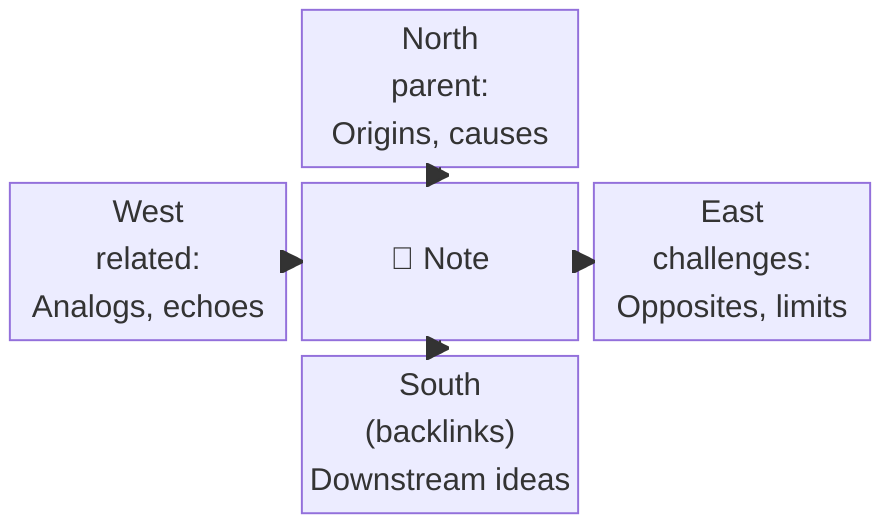

# Zettelkasten

The zettelkasten is the vault's **soil** — a permanent archive of atomic concept notes, each capturing one idea rewritten in your own words. This is where lasting understanding lives.

The method originates with sociologist Niklas Luhmann and is built on two core principles from [zettelkasten.de](https://zettelkasten.de/overview/):

- **Principle of Atomicity** — put things that belong together into a single note, give it an identity, but limit its content to that single topic.
- **Principle of Connectivity** — set links between notes. Search alone is not enough. Connections compound over time into a web of knowledge that extends your mind and memory.

The zettelkasten guards against the **Collector's Fallacy**: bookmarking, highlighting, and annotating is not learning. You must *interpret your sources* and rely on your own thoughts to get the maximum benefit. The process flows from source → highlights → literature notes → atomic zettel. The zettel is where you stop paraphrasing and start *thinking*.

## Note Types

| Tag | Type | Description |
|-----|------|-------------|
| 📖 | Literature / Concept Note | One idea, in your own words, linked to sources and peers |
| ❓ | Question / Inquiry | A line of inquiry worth tracking — may eventually produce 📖 notes |

## File Naming

`Title - YYYYMMDDHHmm.md` — e.g., `Progressive Overload - 202604151030.md`

The timestamp suffix ensures uniqueness. The first alias is the display name (without timestamp).

## Required Frontmatter

```yaml
aliases:
  - Title Without Timestamp
tags: [📖]  # or [❓]
create-date: "[[YYYY-MM-DD]]"
parent:           # Idea Compass North — origins, causes, higher-order category
related:          # Idea Compass West — similar ideas, analogs, peer notes, maps
referenced-in:    # source material this was derived from
challenges:       # Idea Compass East — competing ideas, limitations, opposites
prompted-by:      # (❓ only) person or note that prompted the question
dg-publish: true
modified-dates:
append_modified_update: true
```

## Key Properties & the Idea Compass

Three linking properties map directly to the [Idea Compass](https://zettelkasten.de/posts/creative-technique-within-zettelkasten-framework/) (Fei-Ling Tseng / Sascha Fast). Place the current note at the center and ask:



| Direction | Question | Property |
|-----------|----------|----------|
| **North** | Where does this idea come from? Origins, causes, higher-order categories. | `parent:` |
| **West** | What is similar? Analogs, echoes, related disciplines. | `related:` |
| **East** | What competes with or contradicts this idea? | `challenges:` |
| **South** | Where does this idea lead? What does it nurture? | *(implicit — notes whose `parent:` points back here; discovered via backlinks)* |

- **`parent:`** — The upstream source or category this concept belongs to (North)
- **`related:`** — Maps of Content, peer notes, and analogs (West). This is how maps discover notes.
- **`challenges:`** — Notes that contradict or complicate this idea (East)
- **`referenced-in:`** — The specific reference note or highlight file the idea was derived from
- **`supersedes:`** — Points to an older zettel this note replaces when your understanding fundamentally changes

## Body Structure

```markdown
# Content

[Your explanation of the concept in your own words — one idea per note]

![[Optional Excalidraw Diagram]]

# References

[[Source Highlights#^ref-NNNN]]

# Flashcards
[Optional spaced-repetition content]
```

## Associated Workflows

- **`/garden plant`** — Process a source and extract concepts into 📖 notes
- **`/garden tend`** — Connect disconnected notes, find challenges, refine understanding

## Tending States (visible in `Garden.base`)

| State | Compass gap | What it means | Action needed |
|-------|-------------|--------------|---------------|
| Disconnected | No North, no West | Empty `parent:` and `related:` — the note floats in isolation | Find its origin (North) and connect to maps/peers (West) |
| Unchallenged | No East | Has sources but no `challenges:` — the idea has never been tested | Find competing or contradicting ideas (East) |
| Parentless | No North | No `parent:` set — the note has no upstream origin | Assign a hierarchical parent — the source, category, or higher-order idea it came from (North) |

## Example Notes in This Vault

- **Progressive Overload** — Model note. All four compass directions populated: North (Endure), West (Exercise Science map), East (Central Governor Theory challenges it), South (Central Governor Theory's body links back).
- **Central Governor Theory** — Model note. Bidirectional East with Progressive Overload — each challenges the other. Shares the same North (Endure) and West (Exercise Science).
- **Sleep and Recovery** — Disconnected: missing North (no `parent:` despite having `referenced-in: Why We Sleep`) and West (no `related:` to any map). No East either. Tending should fill all three.
- **Protein Timing** — Unchallenged: has North (Hypertrophy article) and West (Nutrition map), but no East. What competes with or complicates this idea?
- **Muscle Memory** — Parentless: has West (Exercise Science) but no North. Where does this concept originate? Which source book or article?
- **Periodization** — Fully orphaned: no North, no West, no East, no `referenced-in`. Worst-case tending scenario — every compass direction needs filling.
- **Does Cold Exposure Improve Recovery** — ❓ question note. Has West (Exercise Science) and `prompted-by` (Sleep and Recovery). No North or East yet — the inquiry is open.
